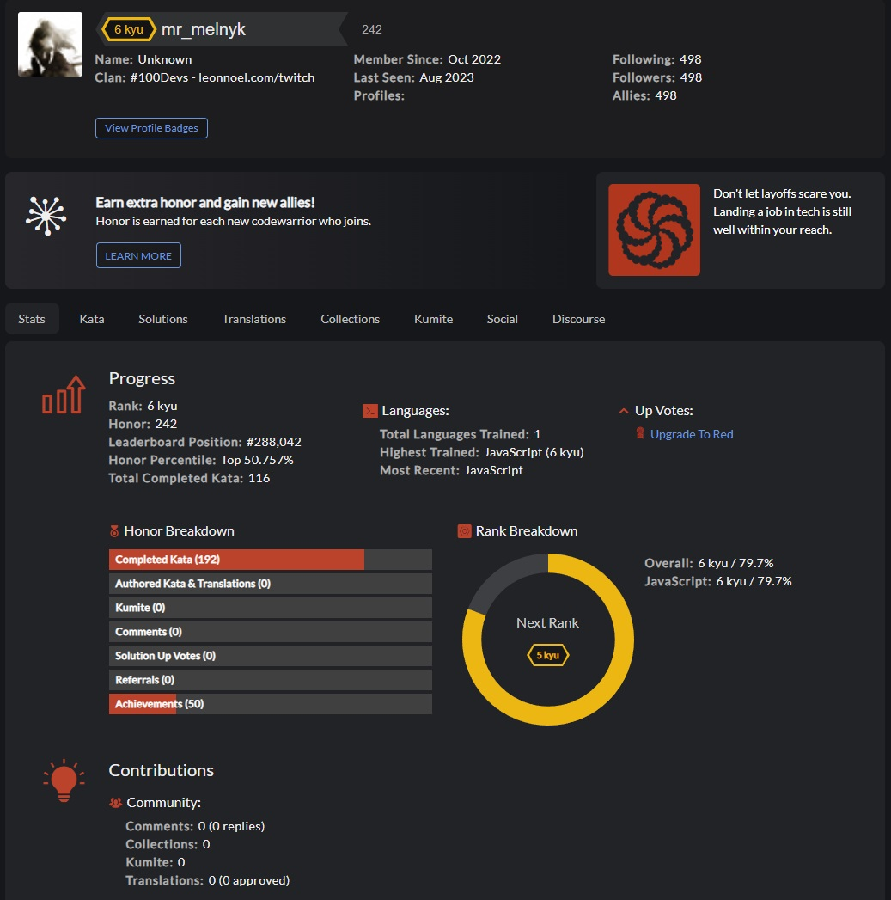

# CodeWars - <a href='https://www.codewars.com/users/mr_melnyk'>My Profile Page</a>

 

This is a repo to hold the coding challenges that I have completed through the Code Wars webiste. 
The challenge that I have set for myself is to complete and commit a new challenge every day. Each challenge will have an HTML file and a JS file. The HTML file will have the instructions and examples of the challenge, and the JS file will have the solution to the challenge.
#I will be starting out with only JS challenges, but will eventually move into other languages.

# How's It's Made:

Tech: HTML, JavaScript

# Optimizations:

I will revisit solutions and find ways to refactor code to clean it up and make it as easy to read and work with as I can.

# Lessons Learned:

I know through doing daily problem solving that there's always going to be something else for me to learn. And by challenging myself I am able to figure out new ways to complete tasks, and that there's never only one way to finish something. Be able to adapt and learn constently keeps my mind sharp and ready to take on new challenges.
